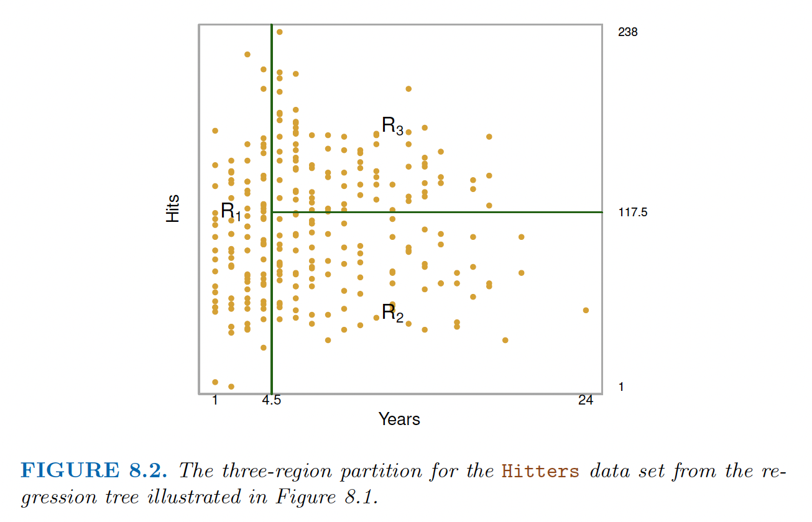

# (PART\*) Statistical Learning Approaches {.unnumbered}  

# Tree-based Methods  
This section is heavily adapted from ISLR version 2 [@james2013]  

## Basics of decision trees    

### Regression trees  

Tree-based methods involve *stratifying or segmenting* the predictor space into a number of segmented regions. We then make a prediction by using the mean or mode of the response value for the training observations in the region for which it belongs. However, decision trees are not competitive with other learning approaches, and often users have to use approaches such as *random forest* which involves producing multiple trees that are combined to yield a single consensus prediction.  

(\#fig:unnamed-chunk-1)Decision boundary division in ISLR

The regions $R_1$, $R_2$, and $R_3$ are terminal nodes or leaves of the tree. The specific points of split (e.g. Years >= 4.5) are the internal nodes of the tree. Essentially, we're in a decision tree problem we're dividing the sample space into regions $R_1,...,R_J$ such that it minimizes the residual sum of squares  
$$
\sum_{i = 1}^J \sum_{i \in R_j} (y_i - \hat{y}_{R_j})^2
$$
Since it's unreasonable to consider every partition, we take a top-down, greedy approach called recursive binary splitting. The procedure is *top-down* because it begins at the top of tree (all observations belonging to the same region) and then splits the predictor space. The procedure is *greedy* because at each step of the tree-building process, the *best* split is made at that particular step rather than looking ahead and picking a split that will lead to a better tree at a future step.   

However, decision trees are prone to overfitting, which means that it has low bias and large variance since it fits the data perfectly. This is usually represented by really elaborate and "deep trees" (trees with a lot of internal nodes). One way to avoid overfitting is to grow a smaller tree by growing a deep tree and then prune the large tree by adding a complexity penalty. This means calculating at tree that minimizes the following cost function  
$$
\sum_{m=1}^{|T|} \sum_{x_i \in R_m} (y_i - \hat{y}_{R_m})^2 + \alpha|T| 
$$
The hyperparameter $\alpha$ controls the degree of penalty for deep trees, where higher $\alpha$ means more branches are pruned. This is very similar to the LASSO or Ridge penalties for linear regression.  

### Classification Trees  
A classification tree is very similar to a regression tree, except that it is used to predict a qualitative response rather than a continuous one. For a classification tree, we predict that each observation belongs to the most commonly occurring class of the training observations of the region where it belongs. In addition to what is the class label, we're interested in the *class proportion* among the training observations that belong to that region.  

