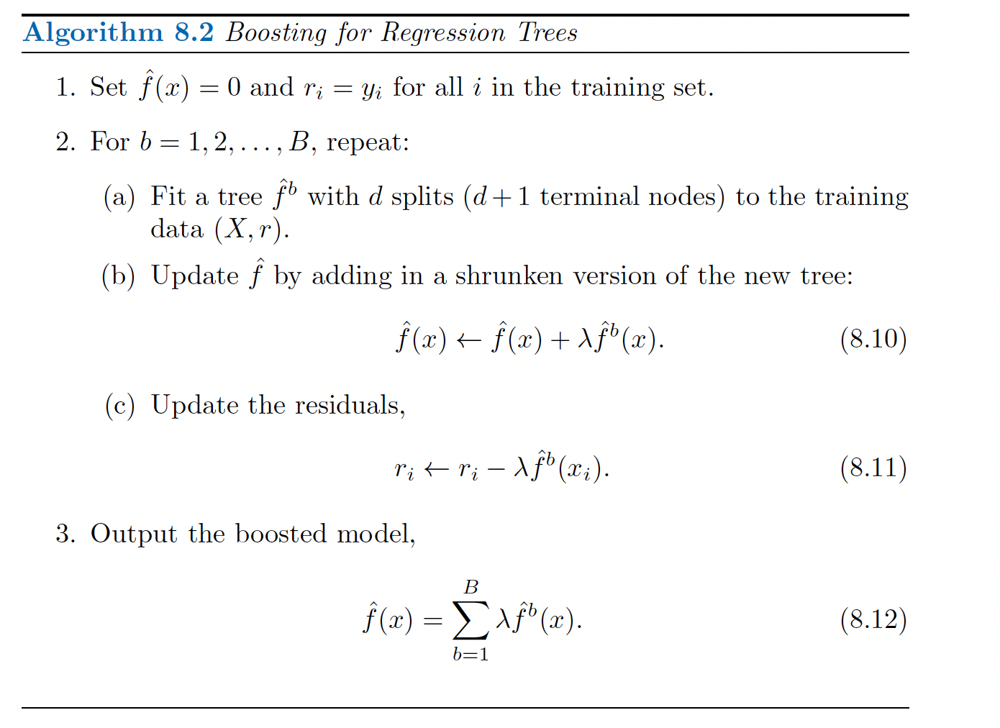
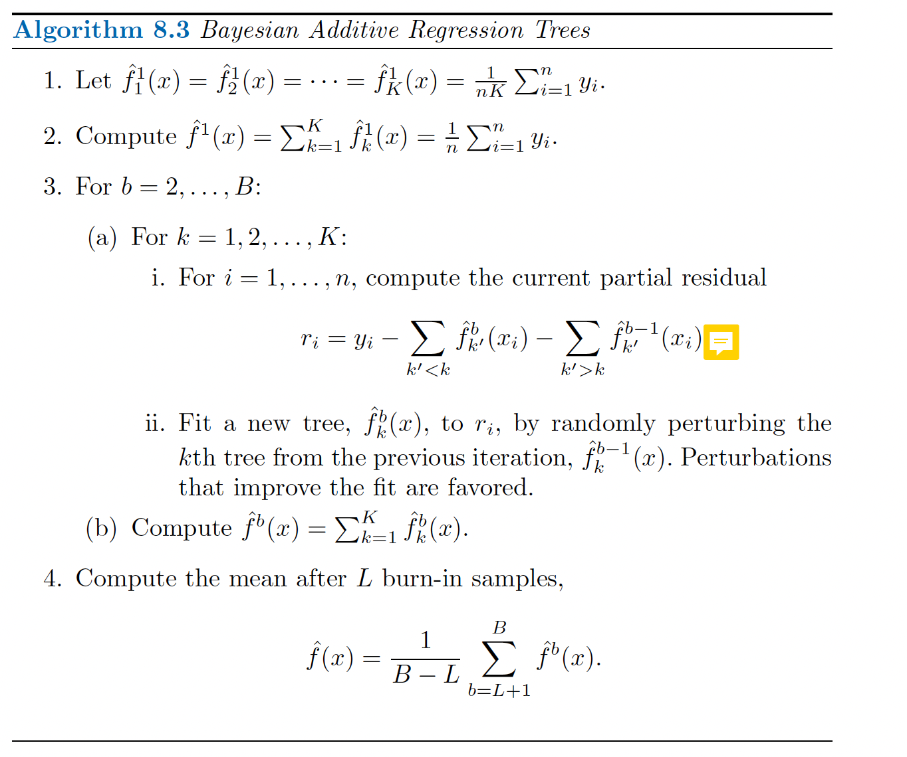

# (PART\*) Supervised Statistical Learning {.unnumbered}  

# Tree-based Methods  
This section is heavily adapted from ISLR version 2 [@james2013]  

## Basics of decision trees    

### Regression trees  

Tree-based methods involve *stratifying or segmenting* the predictor space into a number of segmented regions. We then make a prediction by using the mean or mode of the response value for the training observations in the region for which it belongs. However, decision trees are not competitive with other learning approaches, and often users have to use approaches such as *random forest* which involves producing multiple trees that are combined to yield a single consensus prediction.  

(\#fig:unnamed-chunk-2)Decision boundary division in ISLR

The regions $R_1$, $R_2$, and $R_3$ are terminal nodes or leaves of the tree. The specific points of split (e.g. Years >= 4.5) are the internal nodes of the tree. Essentially, we're in a decision tree problem we're dividing the sample space into regions $R_1,...,R_J$ such that it minimizes the residual sum of squares  
$$
\sum_{i = 1}^J \sum_{i \in R_j} (y_i - \hat{y}_{R_j})^2
$$
Since it's unreasonable to consider every partition, we take a top-down, greedy approach called recursive binary splitting. The procedure is *top-down* because it begins at the top of tree (all observations belonging to the same region) and then splits the predictor space. The procedure is *greedy* because at each step of the tree-building process, the *best* split is made at that particular step rather than looking ahead and picking a split that will lead to a better tree at a future step.   

However, decision trees are prone to overfitting, which means that it has low bias and large variance since it fits the data perfectly. This is usually represented by really elaborate and "deep trees" (trees with a lot of internal nodes). One way to avoid overfitting is to grow a smaller tree by growing a deep tree and then prune the large tree by adding a complexity penalty. This means calculating at tree that minimizes the following cost function  
$$
\sum_{m=1}^{|T|} \sum_{x_i \in R_m} (y_i - \hat{y}_{R_m})^2 + \alpha|T| 
$$
The hyperparameter $\alpha$ controls the degree of penalty for deep trees, where higher $\alpha$ means more branches are pruned. This is very similar to the LASSO or Ridge penalties for linear regression.  

### Classification Trees  
A classification tree is very similar to a regression tree, except that it is used to predict a qualitative response rather than a continuous one. For a classification tree, we predict that each observation belongs to the most commonly occurring class of the training observations of the region where it belongs. In addition to what is the class label, we're interested in the *class proportion* among the training observations that belong to that region.  

Instead of RSS, we evaluate splits based on the Gini Index, which is defined as:  
$$
G = \sum_{k=1}^K \hat{p}_{mk}(1 - \hat{p}_{mk})
$$
where $\hat{p}_{mk}$ is the proportion of training observations in the $m$th region that are from the $k$th class. The Gini index is a measure of node purity, a small value indicates that the split is predominantly of one class. An alternative to the Gini index is entropy (Shannon's Entropy)  
$$
D = -\sum_{k=1}^K \hat{p}_{mk} \log \hat{p}_{mk}
$$

Similarly, low entropy also indicates the purity of the node.  

### Comparing linear and tree models  

We can compare the form of a linear regression model  
$$
f(X) = \beta_0 + \sum_{j = 1}^p X_j\beta_j
$$
and a regression tree  
$$
f(X) = \sum_{m=1}^M c_m \cdot 1_{X \in R_m}
$$
The issue with regression is that it imposes a global linear relationship. If this relationship is obeyed, the linear regression model usually outperforms the decision tree. However, if this relationship is not true (e.g. non linear relationship), then the decision tree is usually better than the classical approach.  

### Advantages and disadvantages of trees  

Advantages:  

* Trees are easy to explain, visualize and is very intuitive.  
* Trees can be displayed graphically and can handle qualitative predictors withoutt he need to create dummy variables 

Disadvantages:  

* Trees do not have the same level of accuracy as regrression approaches  
* Trees are not robust (small changes in the data can cause large changes in estimated three)  

## Bagging, Boosting and Bayesian Additive Regression Trees    

These are *ensemble* methods which *builds many small models* (i.e. weak predictors) and combine them to find a single and very powerful model.  

### Bagging  
Bagging is when we combine the idea of the bootstrap and decision trees. This helps solves the issue of *high variance* by repeatedly creating new data sets and average the predictions across each *high variance* decision tree.   

**Out of Bag Error Estimation (OOB)** is an approach to bagging that produces prediction values based on an OOB evaluation approach rather than the straight forward average prediction of each sample over $B$ bootstrapped training set. Essentially for each bootstrap resample $b$, we train a tree and predict values for all samples not sampled in $b$. Since each boostrap resample $b$ on average uses 2/3rds of the data, each sample will have on average $B$/3 predictions. We average these predictions together to get an OOB prediction for each sample (or majority voting in the case of classifications). This procedure is adopted because OOB error can be used to estimate the test error of abagged model. An OOB MSE or classification error is computed and is a valid estimate of the test error.  

**Variable importance measure** while bagged trees are good for prediction, it removes the ease of interpretability that decision trees has. However, there is a method to achieve the average role of a predictor is to record the total sum of the RSS decreased (or Gini index) when the tree is split at that node, averaged over $B$ trees. Large value indicates that the variable is very important (always chosen across $B$ trees and decreased a large amount of our objective function).   

**Random Forest** is a bagged tree model that add a tweak to *decorrelate* the trees. This is achieved by randomly sampling the $m$ predictors as candidates instead of the full $p$ number of predictors.  We typically choose $m = \sqrt{p}$. This is because when you have similarly strong predictor splits, you would always build very similar trees (hence trees are *correlated*). When averaging over these correlated trees, you're not gaining any new information from the resampling procedure (since you're just getting the same tree again and again and again) and will not lead to the reduction in variance of the prediction.   

### Boosting  
Boosting is a general approach similar to bagging that can be add to any statistical learning approach. Boosting works similar to bagging, but instead of parallell trees, trees are constructed sequentially: each tree is grown using information from previously grown trees (which is why it is more computationally expensive -- bagged models can be done in parallel).  

{width=75%}  

By fitting trees to the residuals, we're actually adding a different model to tackle a portion of the relationship that was not captured by the previous model. Boosted models usually have a number of hyperparameters:  

1. The number of trees $B$. Boosted models can overfit if $B$ is too large but this process is slow. We can use cross validation to select $B$.     
2. The shrinkage parameter $\lambda$. This controls the rate in which the boosting learns. Typical choices are 0.01, 0.001 and it depends on the problem. Small $\lambda$ require large values of $B$ to have good performance.  
3. The number of splits in a tree, which controls the complexity of the boosted ensemble. Often $d = 1$ works well, which the tree is a *stump* having only one split. $d$ is also conisdered the interaction depth, which controls the interaction order of the boosted model.   

Usually even *stump* models are really good and outperforms high order interaction models and random forest  

### Bayesian additive Regression Trees  

BART tries to capture both aspects of random forests and boosted trees, where each tree is constructed in a random manner as in bagging and random forests, and each tree tries to capture signal not yet accounted for in the current model, as in boosting.  

{width=75%}  

This is done by computing a number of trees $K$ on the entire data (similar to bagging). However, each $K$ trees are also grown sequentially at each iteration $B$ (similar to boosting). BART is essentially trying to bag boosted trees together. The difference is that compared to boosting where each new tree is grown at each residual, we computed a partial residual 
$$
r_i = y_i - \sum_{k* < k} \hat{f}^b_{k*}(x_i) - \sum_{k* > k} \hat{f}^{b-1}_{k*}(x_i) 
$$
and fit a new tree $\hat{f}_k^b(x)$ to the residual $r_i$ by perturbing the original tree which either changes the structure of the tree by adding or pruning branches or to change the prediction in each terminal node of the tree. BART is termed a Bayesian approach because this perturbation period is similar to sampling from the posterior distribution of the tree space. The algorithm can be viewed as a Markov chain Monte Carlo algorithm.  BART models are really good already out of the box.    

